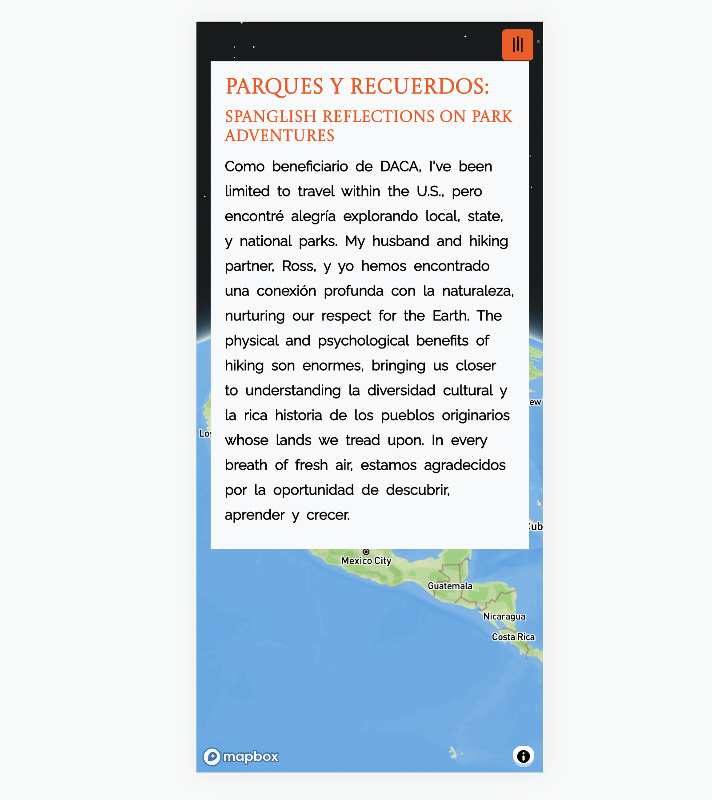
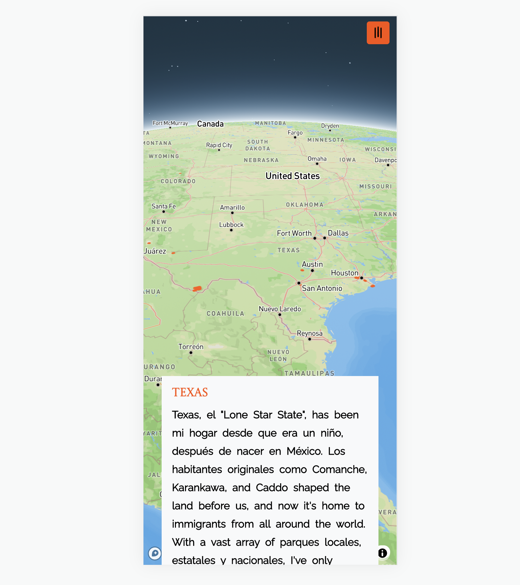

# Parques y Recuerdos

## Description

Parques y Recuerdos: Spanglish Reflections on Park Adventures, is a passionate fusion of my love for travel, photography, and technology. Born from the desire to better express the stories behind images captured during various park adventures, this platform serves as a celebration of my journey, shared with the world through a unique 'Spanglish' narrative.

Leveraging cutting-edge technologies such as REACT, Node.js, and Express, and enriched with the contextual power of Mapbox, "Parques y Recuerdos" invites you on a virtual journey. Relive the emotions, stories, and cultures inherent in each snapshot. This project is not only a testament to my technical skills but also a reflection of my personal life as a proud bilingual individual.

As you explore this README and the project it represents, I hope you will find value in the technical journey, enjoy the vibrant imagery, and perhaps even feel inspired to embark on your own adventures. Whether they be on park trails or through lines of code, the journey is yours to make. Enjoy!

## Table of Contents

- [Installation](#installation)
- [Usage](#usage)
- [Screenshot](#screenshot)
- [Video](#video)

## Installation
A separate GitHub Repository (a template of this project), along with steps and documentation will be shared at a later time. 

## Usage

You can view the deployed application by [clicking this link](https://fdeaquino.github.io/parques-y-recuerdos/#welcome).

## Screenshot

[Video of usage](https://drive.google.com/file/d/1D3zZz2x0CxtCwTIdFDFZ_MJeA80UqJge/view?usp=sharing)

## Credits

- [Original 2018 Project by Lauren Hallden](https://github.com/laurenhallden/travellog)
- [Mapbox Developer Documentation](https://docs.mapbox.com/)
- [React Router Dom Documentation](https://reactrouter.com/en/main/start/tutorial#tutorial)
- [React Router Hash Link Documentation](https://www.npmjs.com/package/react-router-hash-link)

